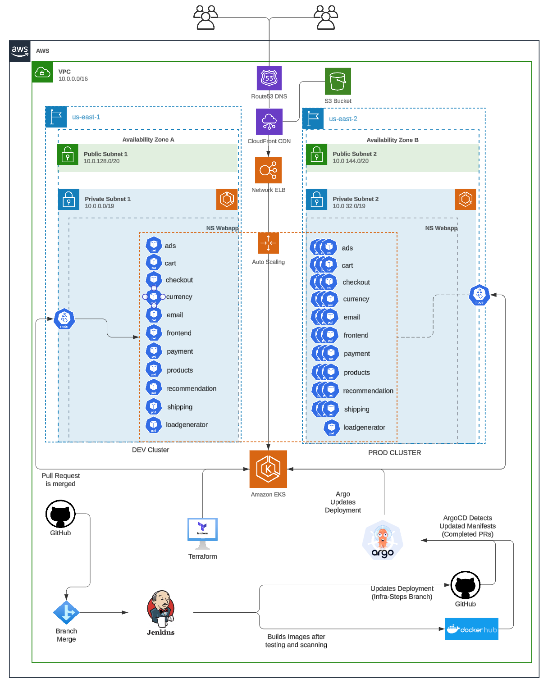
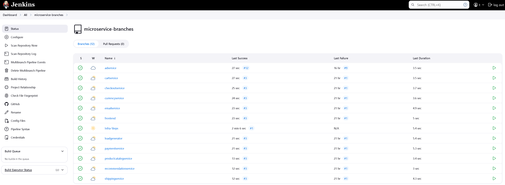
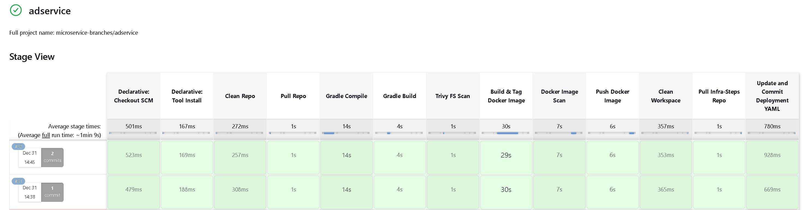
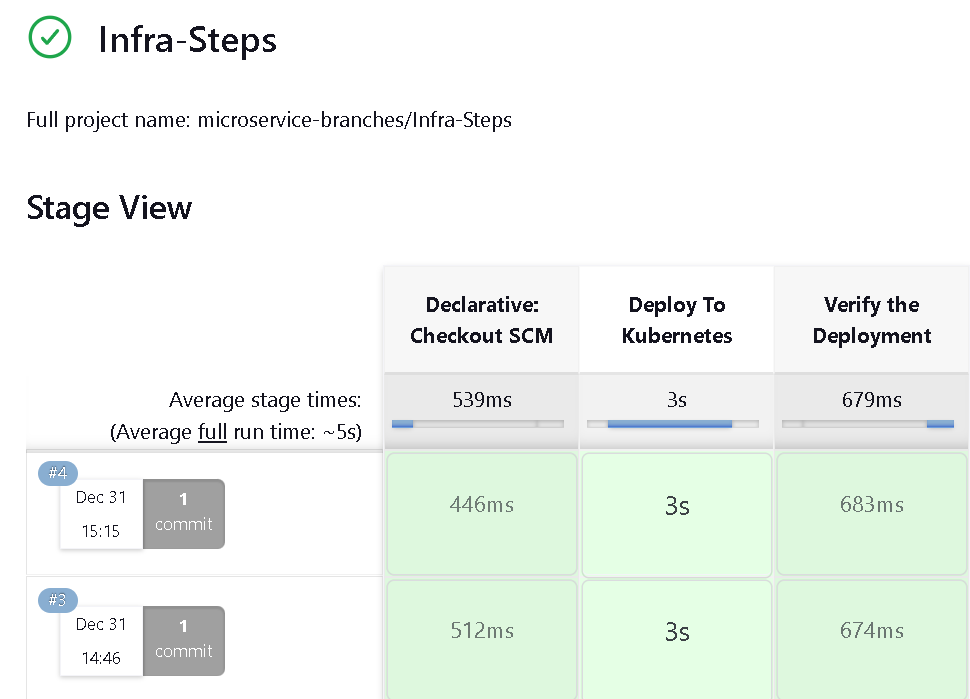
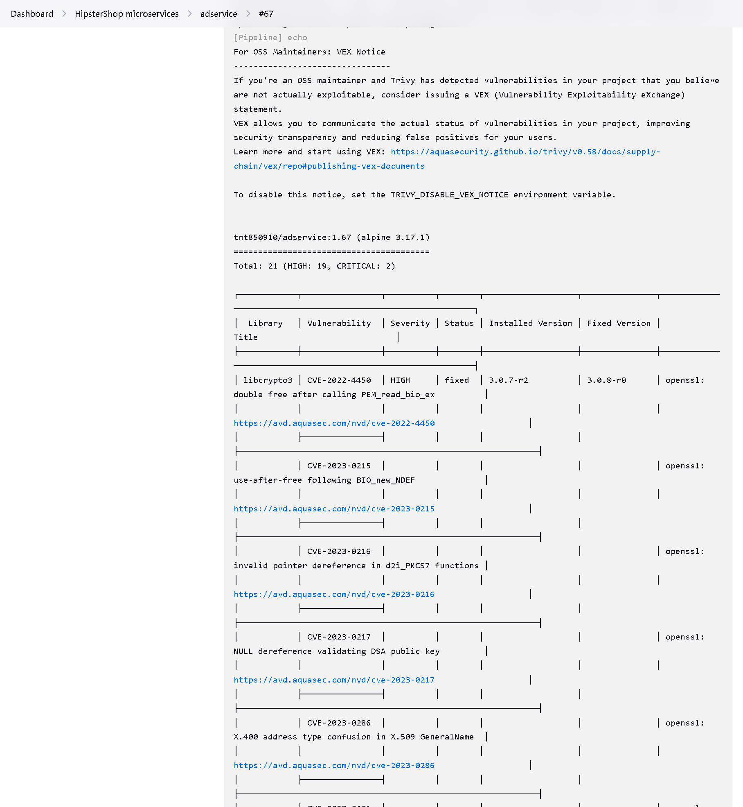
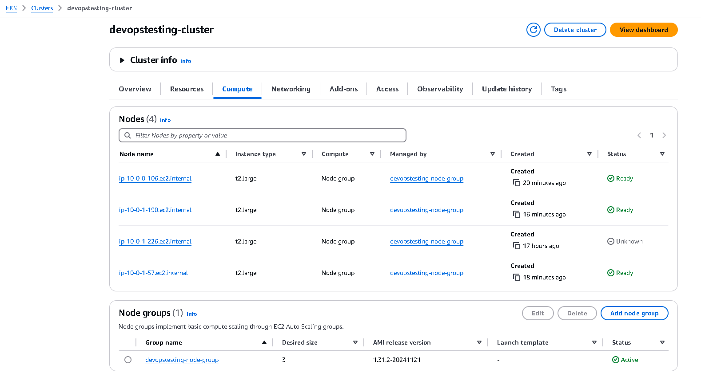

# EKS Microservices Delivery with Jenkins

A Jenkins-based delivery system for
[Google Cloud's Online Boutique](https://github.com/GoogleCloudPlatform/microservices-demo).
Each microservice has its own branch and Jenkinsfile, while the `Infra-Steps`
branch owns the Kubernetes manifest applied to Amazon EKS.



## Branch layout

This repository uses branches as independent service workspaces:

| Branch | Contents |
| --- | --- |
| `adservice` | Java/Gradle ad service and Jenkinsfile |
| `cartservice` | C# cart service and Jenkinsfile |
| `checkoutservice` | Go checkout service and Jenkinsfile |
| `currencyservice` | Node.js currency service and Jenkinsfile |
| `emailservice` | Python email service and Jenkinsfile |
| `frontend` | Go frontend and Jenkinsfile |
| `loadgenerator` | Python/Locust load generator and Jenkinsfile |
| `paymentservice` | Node.js payment service and Jenkinsfile |
| `productcatalogservice` | Go product catalog and Jenkinsfile |
| `recommendationservice` | Python recommendation service and Jenkinsfile |
| `shippingservice` | Go shipping service and Jenkinsfile |
| `Infra-Steps` | Kubernetes deployment manifest and delivery Jenkinsfile |
| `main` | Architecture, setup instructions, and screenshots |

To work on one service, clone or switch directly to its branch:

```bash
git clone --branch adservice https://github.com/T-Py-T/eks-jenkins-microservices-cicd.git
cd eks-jenkins-microservices-cicd
./gradlew test
```

## Delivery flow

```text
service branch change
      │
      ▼
Jenkins multibranch pipeline
      │
      ├──► source scan with Trivy
      ├──► native compile and tests
      ├──► container build
      ├──► image scan with Trivy
      └──► versioned image push
                    │
                    ▼
        update Infra-Steps manifest
                    │
                    ▼
           deploy and verify on EKS
```

Each service Jenkinsfile runs the service's native build before publishing an
image. It then updates the corresponding image reference in the
`Infra-Steps` branch. The infrastructure pipeline applies that versioned
manifest to EKS.

## Jenkins setup

Requirements:

- Jenkins with multibranch Pipeline and Docker support;
- Java, Gradle, Go, Node.js, Python, and .NET agents as required by the branches;
- Trivy installed on build agents;
- Docker registry credentials;
- Git credentials that can update `Infra-Steps`; and
- AWS credentials and `kubectl` access to the EKS cluster.

The example Jenkinsfiles refer to these credential IDs:

- `git-cred` for repository access;
- `docker-cred` for the container registry.

Update the repository URL, Docker Hub namespace, credentials, and EKS cluster
name before running the pipelines in a new environment.

## Validate a branch locally

Use the native test command for the selected service. Examples:

```bash
# Java ad service
git switch adservice
./gradlew test

# Go shipping service
git switch shippingservice
go test ./...

# Node payment service
git switch paymentservice
npm ci
npm test
```

Validate the deployment branch without applying it:

```bash
git switch Infra-Steps
python -m pip install pyyaml
python - <<'PY'
from pathlib import Path
import yaml

path = Path("deployment-service.yml")
list(yaml.safe_load_all(path.read_text()))
print(f"ok: {path}")
PY
```

## Infrastructure

The EKS environment used by this lab was created with Terraform from
[`devops-install-scripts`](https://github.com/T-Py-T/devops-install-scripts).
The cluster includes the VPC, subnets, node group, IAM roles, and networking
required for the application.

After configuring AWS access:

```bash
aws eks update-kubeconfig --name <cluster> --region <region>
kubectl get nodes
git switch Infra-Steps
kubectl apply --dry-run=server -f deployment-service.yml
kubectl apply -f deployment-service.yml
kubectl get pods,svc
```

## Application architecture

[](docs/img/architecture-diagram.png)

The services communicate over gRPC. The frontend provides the browser-facing
store, Redis backs the cart, and the bundled load generator produces synthetic
shopping traffic.

The application code is from Online Boutique. The branch-per-service Jenkins
pipelines, registry workflow, EKS integration, and deployment branch are the
repository-specific work.

## Screenshots

| Stage | Capture |
| --- | --- |
| Jenkins multibranch project |  |
| Service pipeline |  |
| Deployment pipeline |  |
| Trivy scan |  |
| EKS cluster |  |

Additional EKS, Terraform, Prometheus, Grafana, and application captures are
available in [`docs/img/`](docs/img).

## License

Repository-specific pipeline, deployment, and documentation work is available
under the [MIT License](LICENSE). Online Boutique code on the service branches
retains Google LLC's Apache License 2.0 notices. See
[THIRD_PARTY_NOTICES.md](THIRD_PARTY_NOTICES.md).
