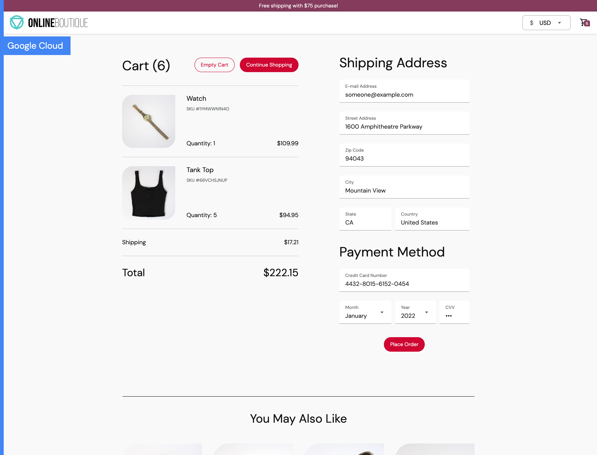

# EKS Microservices Delivery with Jenkins

[](https://github.com/T-Py-T/eks-jenkins-microservices-cicd/actions/workflows/pr-checks.yml)


A Jenkins and Amazon EKS delivery example built around
[Google Cloud's Online Boutique](https://github.com/GoogleCloudPlatform/microservices-demo),
an e-commerce application composed of eleven services written in Java, C#,
Go, Node.js, and Python.

The default branch contains the complete application, its EKS manifest, local
validation tools, and two deliberately separate Jenkins paths: build and scan
one service, then deploy an explicitly selected manifest.


## Repository layout

```text
services/                 eleven Online Boutique services and Dockerfiles
deploy/eks/               Kubernetes resources and the explicit deploy pipeline
scripts/test-service.sh   one local/Jenkins test entry point per service
tests/                    repository policy and service startup checks
Jenkinsfile               parameterized build, scan, and optional publish flow
```

The older service-named branches are retained as project history. `main` is the
supported, self-contained source tree.

## Services

| Service | Language | Responsibility |
| --- | --- | --- |
| `frontend` | Go | Browser-facing store and session handling |
| `cartservice` | C# | Redis-backed cart storage |
| `productcatalogservice` | Go | Product listing and search |
| `currencyservice` | Node.js | Currency conversion |
| `paymentservice` | Node.js | Mock payment processing |
| `shippingservice` | Go | Shipping estimates |
| `emailservice` | Python | Mock order-confirmation email |
| `checkoutservice` | Go | Checkout workflow orchestration |
| `recommendationservice` | Python | Product recommendations |
| `adservice` | Java | Contextual text ads |
| `loadgenerator` | Python/Locust | Synthetic browsing and checkout traffic |

[](docs/img/architecture-diagram.png)

## Delivery flow

The root [`Jenkinsfile`](Jenkinsfile) accepts a service name. A run tests that
service, scans its source, builds its container, and scans the resulting image.
Publishing is disabled by default and requires the `PUBLISH_IMAGE` parameter
plus the configured Docker registry credential.

```text
select service
    │
    ▼
native tests and dependency audit
    │
    ▼
Grype source scan
    │
    ▼
container build and Grype image scan
    │
    └──► optional versioned registry push
```

The deployment pipeline at [`deploy/eks/Jenkinsfile`](deploy/eks/Jenkinsfile)
validates the manifest first. It applies resources only when an operator starts
the job with `APPLY=true`; the repository contains no cluster endpoint or
credential.

## Local validation

Install the current Java, .NET, Go, Node.js, and Python toolchains documented by
the service manifests, plus `pre-commit` and `pip-audit`. Then run:

```bash
pre-commit run --all-files

for service in \
  adservice cartservice checkoutservice currencyservice emailservice \
  frontend loadgenerator paymentservice productcatalogservice \
  recommendationservice shippingservice; do
  ./scripts/test-service.sh "$service"
done
```

Validate the Kubernetes resources without contacting a cluster:

```bash
go run github.com/yannh/kubeconform/cmd/kubeconform@v0.8.0 \
  -strict -summary deploy/eks/deployment-service.yml
```

Every external Docker parent is pinned by digest. The application image names
in the EKS manifest are examples; replace them with the versioned images from
your own successful Jenkins build before applying the manifest.

Run the complete application in an isolated Podman network:

```bash
CONTAINER_ENGINE=podman ./scripts/integration-smoke.sh
```

The smoke test builds all eleven images, starts the storefront and its
dependencies, completes a cart checkout, and runs a short zero-failure load
sample. It removes the test containers and network when the run ends.

The GitHub workflow runs only for pull requests and provides the merge gate for
dependency audits, service tests, startup checks, and manifest validation.

## Jenkins setup

Jenkins agents need Docker, Grype, Skopeo, Java 25, .NET 10, Go 1.27, Node.js
24, Python 3.14, and the language package managers used by the services.
Configure a username/password credential named `docker-cred` if image
publishing is required.

For deployment, configure a Jenkins Kubernetes credential and pass its ID to
the deployment job. Keep registry, AWS, and Kubernetes credentials in Jenkins;
do not commit them to the repository.

## EKS deployment

After replacing the `BUILD_NUMBER` placeholders with your versioned images,
resolve each registry tag to an immutable digest before contacting the cluster:

```bash
python3 scripts/pin_manifest_images.py \
  --input deploy/eks/deployment-service.yml \
  --output .jenkins/deployment-service.resolved.yml
aws eks update-kubeconfig --name <cluster> --region <region>
kubectl apply --dry-run=server -f .jenkins/deployment-service.resolved.yml
kubectl apply -f .jenkins/deployment-service.resolved.yml
kubectl rollout status deployment/frontend
kubectl get pods,svc
```

When `APPLY=true`, the deployment pipeline resolves every versioned image tag
to its registry digest with Skopeo. The pipeline validates and applies only the
resolved manifest. It stops before contacting the cluster if a tag is
`latest`, a placeholder remains, or the registry does not return a digest.

The frontend is exposed through a Kubernetes service. The remaining services
communicate over gRPC using the DNS names declared in the manifest, and Redis
backs the cart service.

## Screenshots

| Stage | Capture |
| --- | --- |
| Jenkins multibranch project |  |
| Service pipeline |  |
| Deployment pipeline |  |
| Earlier Trivy scan |  |
| EKS cluster |  |
| Running storefront |  |

Additional EKS, Terraform, Prometheus, Grafana, and application captures are
available in [`docs/img/`](docs/img).

## License

Repository-specific pipeline, deployment, and documentation work is available
under the [MIT License](LICENSE). Online Boutique source files retain Google
LLC's [Apache License 2.0](LICENSE-APACHE-2.0) notices. See
[`THIRD_PARTY_NOTICES.md`](THIRD_PARTY_NOTICES.md).

## Hireability / what this proves

This repository is a concrete, inspectable delivery-engineering example. It is
not a claim of employment readiness and does not substitute for an interview or
an evaluation rubric.

A reviewer can inspect evidence of the ability to:

- work across an eleven-service application spanning Go, C#, Node.js, Python,
  Java, and Locust;
- design a parameterized Jenkins path that tests and audits a selected service,
  scans source and the resulting image, builds a container, and keeps image
  publishing explicitly optional;
- separate build and deployment concerns, validate Kubernetes resources, pin
  registry tags to digests, and require an explicit `APPLY=true` before cluster
  changes;
- document repeatable local checks for pre-commit, service tests, dependency
  audits, manifest conformance, and an isolated integration smoke test; and
- keep registry, AWS, and Kubernetes credentials in Jenkins rather than in the
  repository.

What this proves is limited to the engineering decisions and repeatable checks
that this repository documents and that a reviewer can inspect or run. It does
not prove production uptime, capacity, security certification, a live-cluster
outcome, or any hiring/evaluation score. No score is assigned or implied.

## Steward tip-cite bank

For a compact citation of a merged documentation tip, use the 8-character
`main` tip prefix and pull request number:

> Tip-cite: main `<8-char-tip>` + PR #<n>.

The Steward resolves the short prefix to the full SHA. This citation bank does
not mark work READY; do not invent or infer scores.

---

> Tip-cite: main `<8-char-tip>` + PR #<n>. Steward resolves; no READY claim or score is implied.
