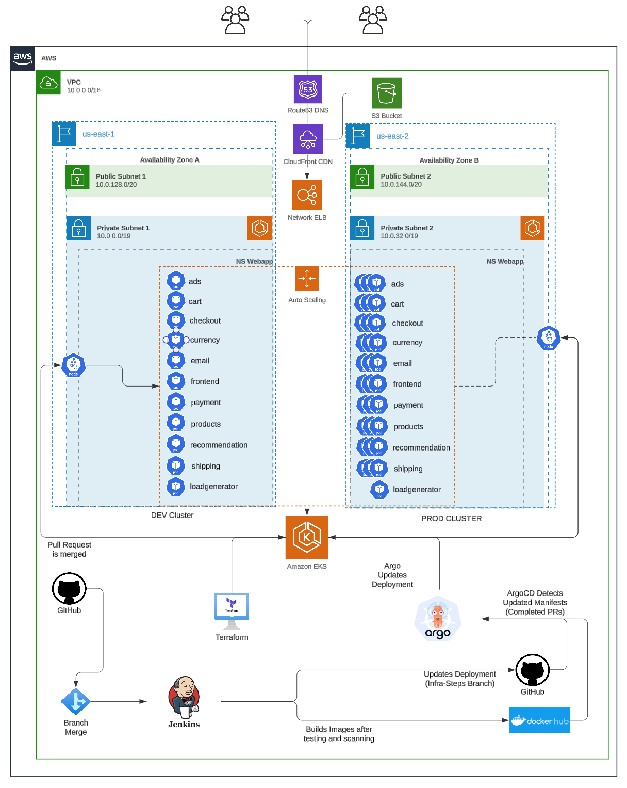
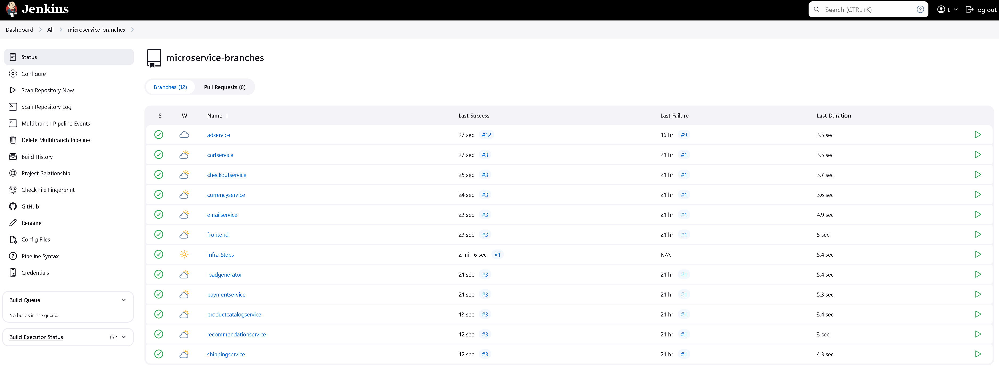
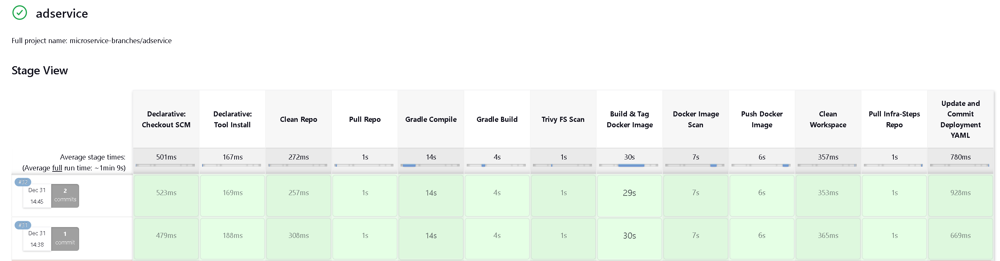
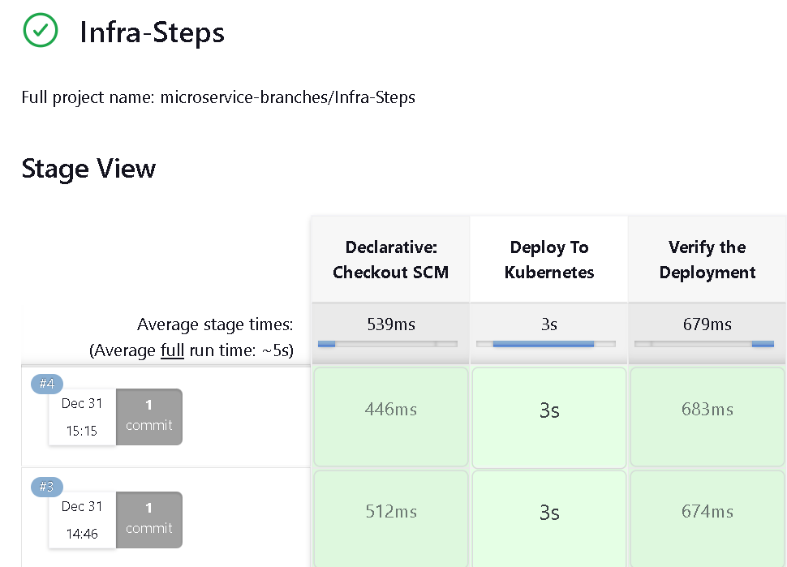
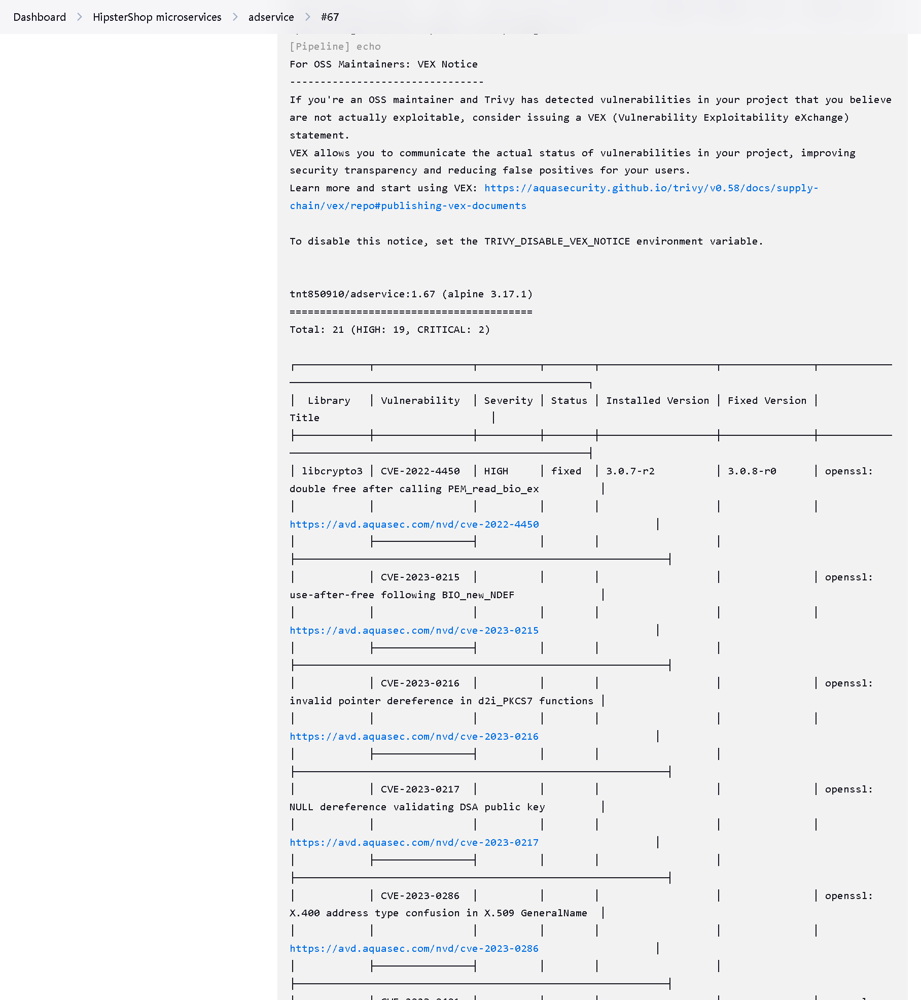
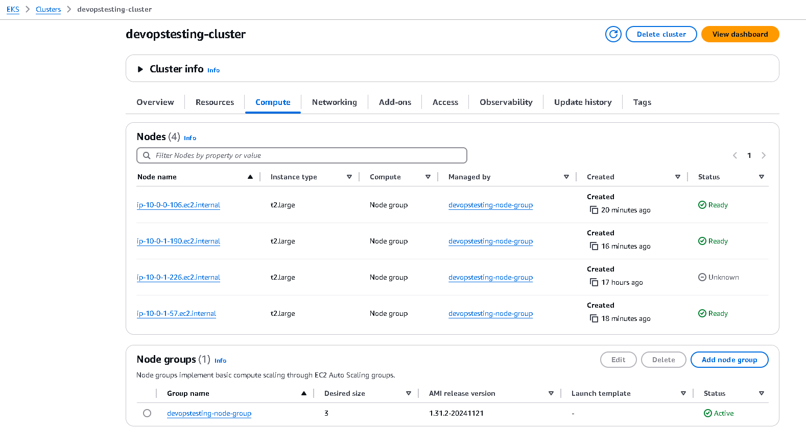
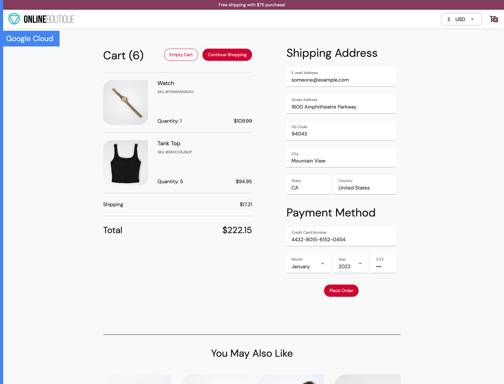

<div align="center">

# EKS Microservices Delivery with Jenkins

**Two Jenkins pipelines, one storefront: build and scan one service at a time, then deploy only what you pinned.**

A Jenkins and Amazon EKS delivery path built around Google Cloud's
[Online Boutique](https://github.com/GoogleCloudPlatform/microservices-demo),
an e-commerce app made of eleven services written in Java, C#, Go, Node.js
and Python.

[](https://github.com/T-Py-T/eks-jenkins-microservices-cicd/actions/workflows/pr-checks.yml)

[Getting started](#getting-started) ·
[Worked path](#worked-path-validate-offline-like-the-pipelines-do) ·
[Two pipelines](#two-pipelines-build-vs-apply) ·
[Deploy to EKS](#deploy-to-your-own-eks-cluster) ·
[Contributing](#contributing)



<sub>The target design. The repository holds the Jenkins pipelines, the EKS manifest and the services. Route 53, CloudFront, Terraform and Argo CD in the diagram have no configuration in this tree.</sub>

</div>

## What you get

- **A build pipeline that touches nothing by default.** The root
  [`Jenkinsfile`](Jenkinsfile) takes a `SERVICE` choice, runs that service's
  tests, Grype-scans the source, builds the image and Grype-scans it.
  It pushes only when `PUBLISH_IMAGE=true` (default `false`).
- **A separate deploy pipeline that applies nothing by default.**
  [`deploy/eks/Jenkinsfile`](deploy/eks/Jenkinsfile) always validates the
  manifest. It contacts a cluster only when `APPLY=true` (default `false`),
  and then only with a digest-pinned copy of the manifest.
- **Digest pinning before apply.**
  [`scripts/pin_manifest_images.py`](scripts/pin_manifest_images.py) resolves
  every image tag to a registry digest. It refuses `latest`, leftover
  placeholders, and tags with no digest.
- **One test entry point per service.**
  [`scripts/test-service.sh`](scripts/test-service.sh) knows how to test each
  of the eleven services. Jenkins and CI both call it.
- **A full local storefront smoke test.**
  [`scripts/integration-smoke.sh`](scripts/integration-smoke.sh) builds all
  eleven images, starts them on an isolated Podman network, completes a cart
  checkout, and runs a short load sample.

## Getting started

### Prerequisites for local checks

- Python 3 and [`pre-commit`](https://pre-commit.com/)
- Go (the kubeconform module asks for Go 1.26 or newer; with the default
  `GOTOOLCHAIN=auto`, `go` downloads it)
- Node.js and npm for the Node services
- Optional, for the other services: Java 25, .NET 10 and `pip-audit`
- Optional, for the full smoke test: Podman

### Clone and check

```bash
git clone https://github.com/T-Py-T/eks-jenkins-microservices-cicd.git
cd eks-jenkins-microservices-cicd

pre-commit run --all-files
go run github.com/yannh/kubeconform/cmd/kubeconform@v0.8.0 \
  -strict -summary deploy/eks/deployment-service.yml
```

Expected output:

```text
repository policy........................................................Passed
Summary: 24 resources found in 1 file - Valid: 24, Invalid: 0, Errors: 0, Skipped: 0
```

## Worked path: validate offline, like the pipelines do

**1. Repository policy.** Checks that workflows run only on pull requests,
Actions and Docker parents are pinned, Alpine packages don't float, the
manifest has no `:latest`, both Jenkinsfiles default to no side effects, and
the image pinning script behaves:

```bash
pre-commit run --all-files
```

**2. Manifest schema.** This is the same command the deploy pipeline's
`Validate manifest` stage runs:

```bash
go run github.com/yannh/kubeconform/cmd/kubeconform@v0.8.0 \
  -strict -summary deploy/eks/deployment-service.yml
```

**3. Test one service.** This is the build pipeline's `Test service` stage,
run locally. Two quick ones:

```bash
./scripts/test-service.sh shippingservice    # go test ./...
./scripts/test-service.sh currencyservice    # npm ci, npm audit, gRPC server boot check
```

**4. Test every service** (not run for this README; needs every toolchain
listed above):

```bash
for service in \
  adservice cartservice checkoutservice currencyservice emailservice \
  frontend loadgenerator paymentservice productcatalogservice \
  recommendationservice shippingservice; do
  ./scripts/test-service.sh "$service"
done
```

**5. Run the whole store locally** (not run for this README; builds eleven
images):

```bash
CONTAINER_ENGINE=podman ./scripts/integration-smoke.sh
```

The smoke test removes its containers and network when it finishes.

## Two pipelines: build vs apply

Building an image and changing a cluster are separate jobs with separate
switches.

**Build: root [`Jenkinsfile`](Jenkinsfile)**

```text
SERVICE (choice)
    │
    ▼
Prepare          image = <registry>/<service>:1.<BUILD_NUMBER>
    │
    ▼
Test service     ./scripts/test-service.sh <service>
    │
    ▼
Scan source      grype dir:services/<service> --config .grype.yaml
    │
    ▼
Build image      docker build
    │
    ▼
Scan image       grype <image> --config .grype.yaml
    │
    └──► Publish image   only when PUBLISH_IMAGE=true
```

**Apply: [`deploy/eks/Jenkinsfile`](deploy/eks/Jenkinsfile)**

```text
Validate manifest         kubeconform on deploy/eks/deployment-service.yml
    │
    └──► Deploy to Kubernetes   only when APPLY=true
             pin_manifest_images.py → .jenkins/deployment-service.resolved.yml
             kubeconform the resolved manifest
             kubectl apply the resolved manifest
             kubectl rollout status deployment/frontend
```

The build pipeline never pushes to Git. The deploy pipeline stores no cluster
endpoint and takes its Kubernetes credential ID (`KUBE_CREDENTIALS_ID`) and
namespace (`NAMESPACE`) as parameters.

## Services

| Service | Language | Responsibility |
| --- | --- | --- |
| `frontend` | Go | Browser-facing store and session handling |
| `cartservice` | C# | Redis-backed cart storage |
| `productcatalogservice` | Go | Product listing and search |
| `currencyservice` | Node.js | Currency conversion |
| `paymentservice` | Node.js | Mock payment processing |
| `shippingservice` | Go | Shipping estimates |
| `emailservice` | Python | Mock order-confirmation email |
| `checkoutservice` | Go | Checkout workflow orchestration |
| `recommendationservice` | Python | Product recommendations |
| `adservice` | Java | Contextual text ads |
| `loadgenerator` | Python/Locust | Synthetic browsing and checkout traffic |

[](docs/img/architecture-diagram.png)

```text
services/                 eleven Online Boutique services and Dockerfiles
deploy/eks/               EKS manifest and the deploy pipeline
scripts/                  per-service tests, integration smoke, image pinning
tests/                    repository policy, pinning, and service startup checks
Jenkinsfile               parameterized build, scan, and optional publish
```

Older service-named branches are kept as history. `main` is the supported,
self-contained tree.

## Jenkins setup

Not run for this README. Nothing here claims that a Jenkins server or EKS
cluster is running now.

- Agents need Docker, Grype, Skopeo, Java 25, .NET 10, Go 1.27, Node.js 24,
  Python 3.14, and the services' package managers.
- Create a username/password credential named `docker-cred` if you will
  publish images.
- Create a Kubernetes credential for the deploy job and pass its ID as
  `KUBE_CREDENTIALS_ID` (default `k8-cred`).

Keep registry, AWS and Kubernetes credentials in Jenkins, never in the
repository.

## Deploy to your own EKS cluster

Not run for this README; this needs your own registry images, AWS account and
cluster.

Replace each `BUILD_NUMBER` placeholder in the manifest with an image from a
successful build. Then pin the tags to digests and apply only the resolved
copy:

```bash
python3 scripts/pin_manifest_images.py \
  --input deploy/eks/deployment-service.yml \
  --output .jenkins/deployment-service.resolved.yml
aws eks update-kubeconfig --name <cluster> --region <region>
kubectl apply --dry-run=server -f .jenkins/deployment-service.resolved.yml
kubectl apply -f .jenkins/deployment-service.resolved.yml
kubectl rollout status deployment/frontend
kubectl get pods,svc
```

A Kubernetes service exposes the frontend. The other services talk over gRPC
using the DNS names in the manifest, and Redis backs the cart service.

## Gallery

These are historical captures from an earlier version of this project, when
each service had its own branch and pipeline and scans used Trivy. The current
Jenkinsfiles are the parameterized, Grype-based pipelines described above.
The captures show what a run looked like then; they are not evidence that
anything is running today.

| Stage | Capture |
| --- | --- |
| Jenkins multibranch project |  |
| Per-service pipeline (earlier layout) |  |
| Deploy pipeline (earlier layout) |  |
| Trivy scan (earlier layout) |  |
| EKS cluster |  |
| Storefront |  |
| Cart and checkout |  |

More EKS, Terraform, Prometheus and Grafana captures are in
[`docs/img/`](docs/img). The tree has no Terraform or monitoring
configuration.

## Roadmap and open problems

Planned work is in [ROADMAP.md](ROADMAP.md). Known gaps and held decisions are
in [docs/OPEN_PROBLEMS.md](docs/OPEN_PROBLEMS.md). Deploy-specific notes are in
[deploy/eks/README.md](deploy/eks/README.md).

## Contributing

Good first areas: pipeline hardening, more offline checks, manifest
improvements, or clearer Jenkins setup docs.

1. Fork the repository and branch from `main`.
2. Keep one concern per pull request and say which service, pipeline or
   Kubernetes resource it touches.
3. Run `pre-commit run --all-files`, the kubeconform check, and
   `./scripts/test-service.sh <service>` for any service you change.
4. Keep side effects behind explicit parameters (`PUBLISH_IMAGE`, `APPLY`).
   The policy tests enforce this.
5. Never commit credentials. Open a pull request against `main`; the PR Checks
   workflow is the merge gate.

See [CONTRIBUTING.md](CONTRIBUTING.md) for details. Please report
vulnerabilities privately as described in [SECURITY.md](SECURITY.md).

## License

Repository-specific pipeline, deployment and documentation work is available
under the [MIT License](LICENSE). The Online Boutique source files keep Google
LLC's [Apache License 2.0](LICENSE-APACHE-2.0) notices. See
[THIRD_PARTY_NOTICES.md](THIRD_PARTY_NOTICES.md) and [NOTICE.md](NOTICE.md).

## Acknowledgements

- [Online Boutique](https://github.com/GoogleCloudPlatform/microservices-demo)
  by Google Cloud, the application these pipelines deliver
- [Grype](https://github.com/anchore/grype),
  [Skopeo](https://github.com/containers/skopeo) and
  [kubeconform](https://github.com/yannh/kubeconform)
